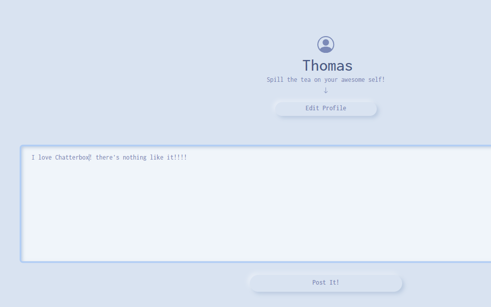
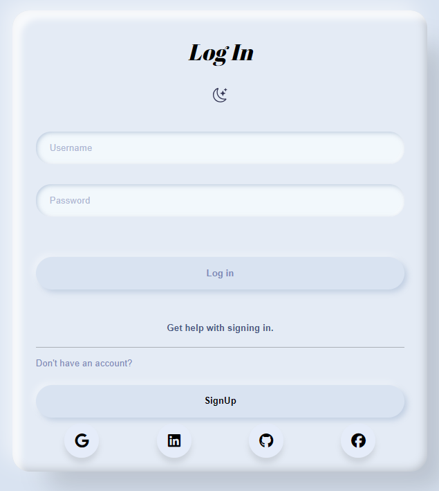
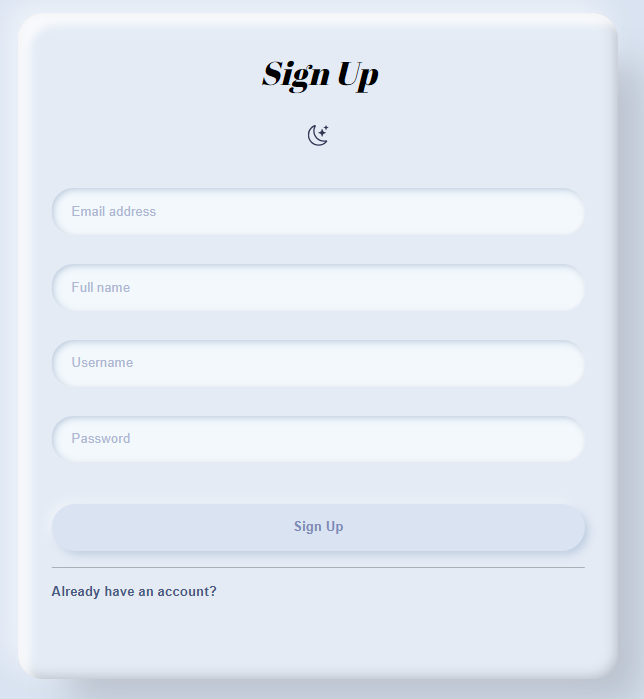
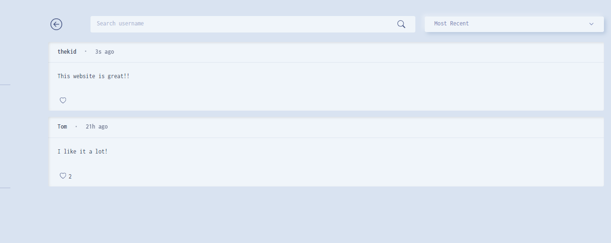
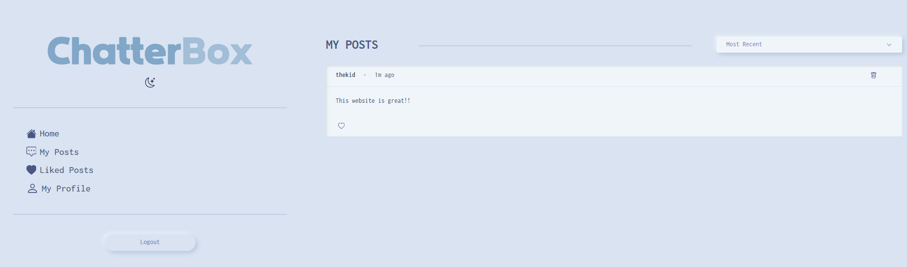
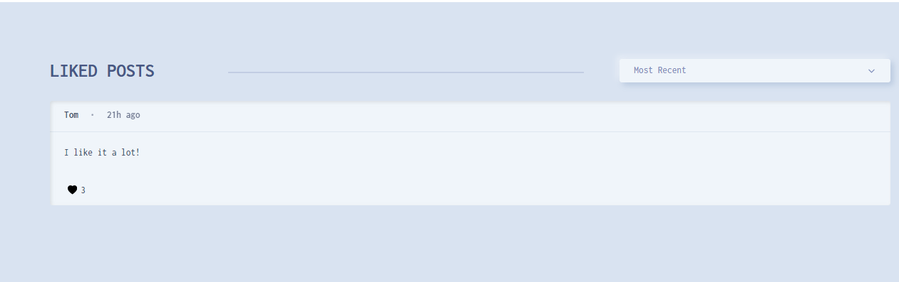
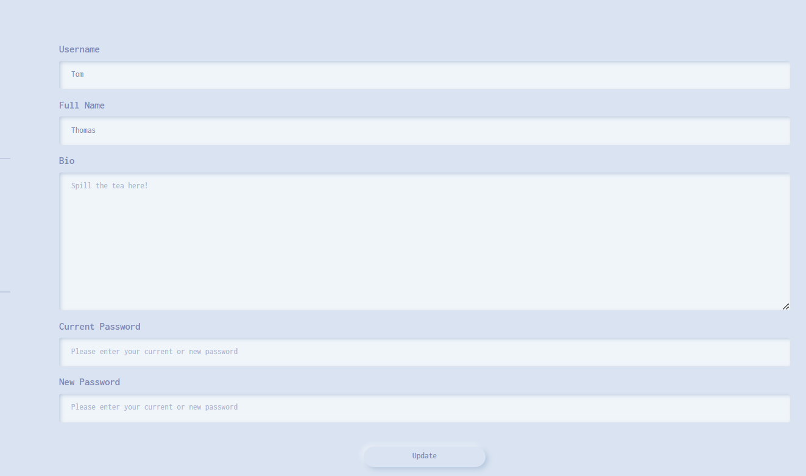
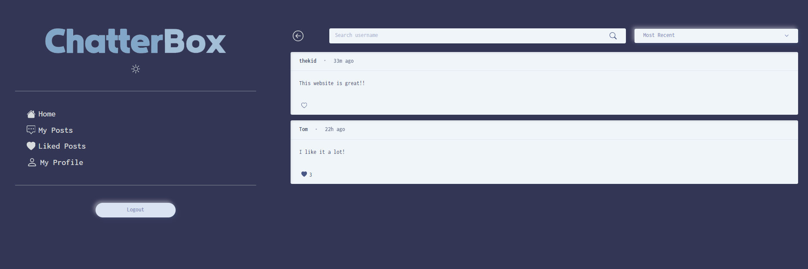
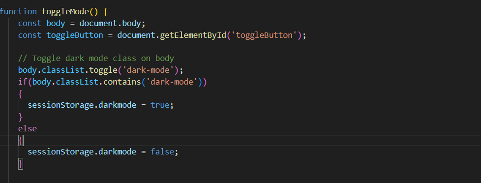

# microblog-lite: ChatterBox
### Capstone 3

Chatterbox is a dynamic blog platform where users can engage in expressive conversations and showcase their personalities through written content. With its interactive interface, Chatterbox provides a vibrant space for individuals to not only share their thoughts but also visually express themselves, fostering a diverse and lively online community.

## Description

#### This website was created using: HTML, CSS, and JavaScript. 

### Login

Our team designed a straightforward login form with an integrated option for both logging in and creating a new account. Upon selecting the sign-up option, users are seamlessly redirected to a dedicated sign-up page featuring a user-friendly sign-up form for account creation.

### Sign Up

Beneath the Sign-Up form, our team incorporated an additional form allowing users to input details for a desired username, along with accompanying fields like full name, email, and password. 

### Home

The home page offers a captivating user experience, allowing individuals to effortlessly browse through a curated feed of posts contributed by both themselves and other users. Users can easily filter content based on their preferences, choosing between sorting options such as most recent, username, and popularity. Additionally, the platform provides a seamless search functionality, enabling users to discover and connect with others by effortlessly exploring and finding fellow users.

### My Posts

The "My Posts" page is a personalized hub where users can manage their own contributions, featuring filters for organizing posts by "Most Recent" and "Popularity." This user-centric space provides a convenient and efficient way to explore and curate their content based on chronological order or overall popularity.

### Liked Posts

The "Liked Posts" page provides users with a curated collection of posts they have liked, offering seamless navigation and filters like "Most Recent" and "Popularity" for an enhanced experience. This dedicated space allows users to revisit and engage with their favorite content, tailored to their preferences.

### My Profile

The "My Profile" page offers users seamless control over personal details, enabling easy editing of username, full name, bio, and password for a personalized and secure experience.

### ChatterBox Dark Mode

Teala adeptly incorporated a dark mode feature on our website using the toggleMode() function. This function toggles the 'dark-mode' class on the body, enabling users to switch between light and dark modes effortlessly. Teala also implemented dynamic icon changes in the toggle button to enhance the visual appeal of the user interface.

## Author's

 [Teala Bradley](https://github.com/Teala-B)
 [Martin Enriquez](https://github.com/TherealJGatsby) 
 [Sayed Hosseini](https://github.com/SayedRZA)
 [Micah Kashiwabara](https://github.com/micah-k98)
 
## Acknowledgments 

 [Bootstrap](https://getbootstrap.com/docs/4.1/components/forms/#inline-forms)

